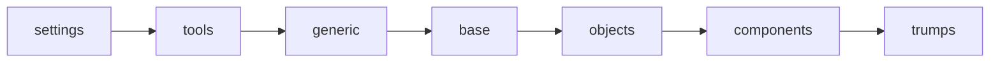

# css 概览

### css 架构

[itcss](https://benmarshall.me/itcss/)


```
itcss
七层 css 结构，自上至下 
	settings -> tools -> generic -> base -> objects -> components -> trumps
越往上它的复用性越好
	settings (设置)： 预处理程序的变量或方法
	tools (工具): mixins 和 函数
		优秀的 github 项目： sassMagic
	generic (常规): css 重置，类似 normalize.css 等功能
	base (元素): 没有类的单个 html 元素选择器  (可以写在具体的组件中)
	objects (对象): 通用的布局类，例如容器类 .list-container
	components (组件): 用于设置任何页面元素和所有页面元素样式的美学类  (使用 bem 的格式来命名类)
	trumps (important): 最重要的样式，用于覆盖其他样式  可以使用 acss 代替
```



### settings -> css 变量

:root{} 的含义

--my-var

通过 js 获取和修改 css 变量

``` js
// 获取一个 Dom 节点上的 CSS 变量
element.style.getPropertyValue("--my-var");

// 获取任意 Dom 节点上的 CSS 变量
getComputedStyle(element).getPropertyValue("--my-var");

// 修改一个 Dom 节点上的 CSS 变量
element.style.setProperty("--my-var", jsVar + 4);
```

### tools -> less 函数

[less 转 css 在线地址](https://www.wetools.com/less-to-css)

### generic -> normalize.css

[css 格式化](https://github.com/necolas/normalize.css.git)

### base -> html, body 等样式

### objects -> 公共布局样式

### components -> 组件样式

bem

### trumps -> 原子化

[css 原子化](https://antfu.me/posts/reimagine-atomic-css-zh)

- [] Tailwind CSS
- [] Windi CSS
- [] UnoCSS

[UnoCSS](https://unocss.dev/guide/)

``` less
@base-size: 4;
@max-size: 64;
.generateGap() {
  .loop(@value) when (@value <= @max-size) {
    .m-r-@{value} {
      margin-right: @value * 1px;
    }
    .m-t-@{value} {
      margin-top: @value * 1px;
    }
    .m-b-@{value} {
      margin-bottom: @value * 1px;
    }
    .m-l-@{value} {
      margin-left: @value * 1px;
    }
    .p-t-@{value} {
      padding-top: @value * 1px;
    }
    .p-b-@{value} {
      padding-bottom: @value * 1px;
    }
    .p-r-@{value} {
      padding-right: @value * 1px;
    }
    .loop(@value + @base-size)
  }
  .loop(4);
}
.generateGap();
```