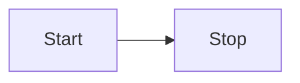
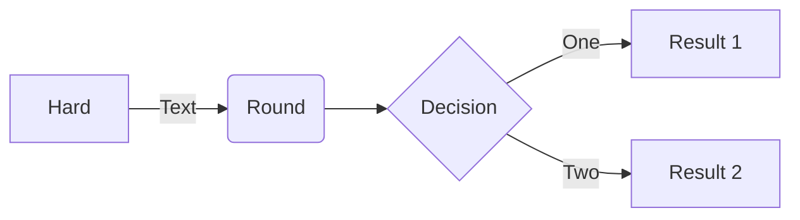

# markdown 语法演示

[官网教程](https://markdown.com.cn/extended-syntax/footnotes.html)

[思维导图官网](https://mermaid.js.org/#/)

``` md
> 引用
```



流程图：
  - 横向
    - LR
    - RL
  - 竖向
    - TB
    - BT



### 代码块

``` js
const hw = 'hello world'
```

``` md
const hw = 'hello world'
```


### 引用

> 引用

```
> 引用
```
### 选择框

**重点：**注意最后一个 ] 之后的空格，否则不生效

- [ ] 选择框
- [x] 选择框

```
- [ ] 选择框
```

### 有序列表
**重点：**注意最后一个空格，否则不生效

1. 

```
1. 
```

### 无序列表
**重点：**注意最后一个空格，否则不生效

- 

```
- 
```

### 超链接

[百度](http://www.baidu.com)

```
[百度](http://www.baidu.com)
```

### 表格

|      |      |      |
| ---- | ---- | ---- |
|      |      |      |
|      |      |      |
|      |      |      |

```
|      |      |      |
| ---- | ---- | ---- |
|      |      |      |
|      |      |      |
|      |      |      |
```

### 图像


```

```

## 文字

### 加粗

**文字**

```
**文字**
```

### 斜体

*文字*

```
*文字*
```
### 下划线

<u>文字</u>

```
<u>文字</u>
```

### 删除线

``` md
~~文字~~
```

~~文字~~


# 标题

# 标题1
## 标题2
### 标题3


```
# 标题1
## 标题2
### 标题3
```
